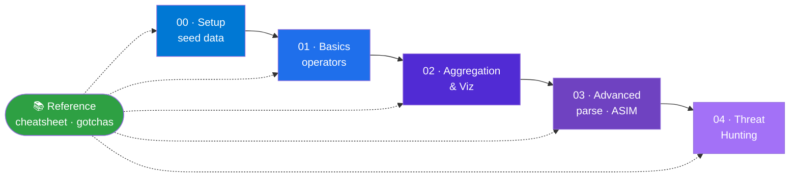

# 🛡️ KQL for Microsoft Sentinel — A Hands-On Learning Path

**From zero to threat hunting in Kusto Query Language — with a dataset you can run even if your Sentinel workspace is empty.**

---

Most KQL tutorials assume logs are already flowing into `SigninLogs` and `AuditLogs`. New or quiet environments don't have that — so the queries return nothing and learning stalls. **This path fixes that:** Stage 00 seeds a realistic dataset with no ingestion required, and every early lab runs against it. Later stages graduate to the real tables once you have data.

> [!NOTE]
> **No data? Practice anyway.** Stage 00 gives you two free ways to get a working dataset in ~5 minutes — a seeded function in Sentinel/Log Analytics, **or** a CSV loaded into an Azure Data Explorer free cluster (no Azure subscription needed).

## 📑 Table of Contents
- [Two ways to practise](#-two-ways-to-practise)
- [Who this is for](#-who-this-is-for)
- [The learning path](#-the-learning-path)
- [Reference](#-reference-use-anytime)
- [How to use this](#-how-to-use-this)
- [Principles](#-principles-baked-in)

## 🗺️ The path at a glance

## 🚀 Two ways to practise — pick one in Stage 00

| You have… | Use | Cost |
|---|---|---|
| A Sentinel / Log Analytics workspace (even empty) | **Seed a saved function** (`datatable` → `DemoIdentityLogs`) | Free |
| No Azure subscription at all | **Azure Data Explorer free cluster + CSV** | Free — no subscription or credit card |

Both produce the same `DemoIdentityLogs` object, so every lab works identically either way.

## 👥 Who this is for
Career starters & students · SOC Tier 1–2 analysts · threat hunters · detection engineers · security architects. Stages run novice → advanced; jump in where you fit.

## 🧭 The learning path

| Stage | Folder | What you learn | Runs on |
|---|---|---|---|
| **00 · Setup** | [`00-setup/`](00-setup/README.md) | Seed a dataset 2 ways (function / CSV+ADX) | — |
| **01 · Basics** | [`01-basics/`](01-basics/README.md) | Pipeline model, `where`, `project`, `extend`, `let`, time hygiene | `DemoIdentityLogs` |
| **02 · Aggregation & Viz** | [`02-aggregation-viz/`](02-aggregation-viz/README.md) | `summarize` family, `bin()`, `render`, `union`, `join` | `DemoIdentityLogs` |
| **03 · Advanced** | [`03-advanced/`](03-advanced/README.md) | Parsing dynamic data, modular `let`, ASIM, viz shaping, series ops | Real tables |
| **04 · Threat Hunting** | [`04-hunting/`](04-hunting/README.md) | 11 MITRE-mapped hunts across identity + endpoint | Real tables |

## 📚 Reference (use anytime)
- [`reference/kql-operator-cheatsheet.md`](reference/kql-operator-cheatsheet.md) — fast operator lookup
- [`reference/schema-gotchas.md`](reference/schema-gotchas.md) — the type/column traps that silently break queries
- [`reference/ms-reference-links.md`](reference/ms-reference-links.md) — every Microsoft Learn source, grouped

## ✅ How to use this

1. Do **Stage 00** once — you'll have `DemoIdentityLogs` in ~5 minutes.
2. Work through **01 → 02**, running every query and attempting the 🧪 exercises before checking answers.
3. When you have real data (or want production patterns), continue to **03 → 04**.
4. Keep the **cheatsheet** and **schema-gotchas** open as you go.

## 🧱 Principles baked in

- **Runnable first.** Every early query executes against seeded data — no "trust me, it works."
- **One narrative.** The same five demo users carry through every example.
- **Schema-accurate.** Real-table queries use only columns validated against the Microsoft table references.
- **Tier-1 sourced.** Claims link to Microsoft Learn; thresholds in hunts are tunable starting points, not gospel.

---

*Built as world-class, practice-ready training material.*
**Contributions welcome** — keep queries schema-validated and link Tier-1 sources.

