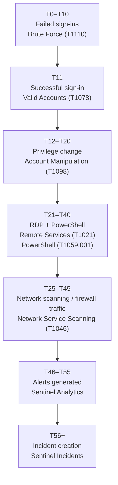
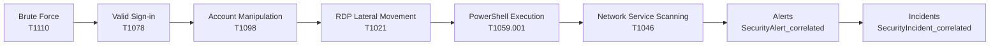

# Correlated Attack Scenario for Microsoft Sentinel


## Overview

This dataset simulates a **multi-stage attack** unfolding over a fixed timeline. Each session represents an adversary who:

- Brute-forces an account
- Signs in with valid credentials
- Escalates privileges
- Moves laterally via **RDP**
- Executes malicious **PowerShell**
- Performs internal network scanning
- Triggers **Microsoft Sentinel** alerts and incidents

Each session is linked end-to-end using a shared **`CorrelationId`** across tables.

## Included Tables

Nine correlated tables are designed to be ingested into **Microsoft Sentinel** (or any Kusto-based environment):

- `SigninLogs_correlated.csv`
- `AuditLogs_correlated.csv`
- `SecurityEvent_correlated.csv`
- `Syslog_correlated.csv`
- `CommonSecurityLog_correlated.csv`
- `AzureActivity_correlated.csv`
- `OfficeActivity_correlated.csv`
- `SecurityAlert_correlated.csv`
- `SecurityIncident_correlated.csv`

> Each table typically contains **50–200 rows** per file across **10 attack sessions**.

## Attack Timeline (T0–T56+)



## Visual Attack Flow



## Shared Correlation Anchors

Use these fields to link activity across logs:

| Field                | Purpose                                                                                                                                                                                                          |
| -------------------- | ---------------------------------------------------------------------------------------------------------------------------------------------------------------------------------------------------------------- |
| TimeGenerated        | Aligns events chronologically; this timestamp is recorded in UTC.                                                                                                                                                |
| UserPrincipalName    | Cloud‑identity (e.g., user1@contoso.com) used for sign‑ins and activity logs.                                                                                                                                    |
| AccountName          | On‑premises account name (e.g., user1) used in security events.                                                                                                                                                  |
| IPAddress / SourceIP | Network origin of the activity.                                                                                                                                                                                  |
| Computer             | Hostname of the system on which the event occurred.                                                                                                                                                              |
| CorrelationId        | Session identifier linking all events belonging to the same attack instance. The SigninLogs table includes a CorrelationId field for troubleshooting sign‑ins; this dataset extends that concept to every table. |
| AlertId → IncidentId | In SecurityAlert_correlated.csv each alert has an AlertId and a corresponding IncidentId. Incidents aggregate multiple alerts based on correlation.                                                              |

## MITRE ATT&CK Mapping

| Phase                              | Technique                                                                                                                                                                                   | ID        | Primary Tables                                      |
| ---------------------------------- | ------------------------------------------------------------------------------------------------------------------------------------------------------------------------------------------- | --------- | --------------------------------------------------- |
| Credential access                  | Brute Force – adversaries systematically guess passwords to gain access.                                                                                                                    | T1110     | SigninLogs_correlated.csv                           |
| Initial access                     | Valid Accounts – using existing account credentials to access resources.                                                                                                                    | T1078     | SigninLogs_correlated.csv                           |
| Persistence / Privilege Escalation | Account Manipulation – modifying credentials or group memberships to preserve or elevate access.                                                                                            | T1098     | AuditLogs_correlated.csv                            |
| Lateral movement                   | Remote Services – using valid credentials to log into RDP/SSH and perform actions as that user.                                                                                             | T1021     | SecurityEvent_correlated.csv                        |
| Execution                          | Command and Scripting Interpreter (PowerShell) – adversaries abuse PowerShell to execute code.                                                                                              | T1059.001 | Syslog_correlated.csv, SecurityEvent_correlated.csv |
| Discovery                          | Network Service Scanning – scanning network services using port or vulnerability scans.                                                                                                     | T1046     | CommonSecurityLog_correlated.csv                    |
| Detection                          | Sentinel Analytics – analytics rules detect suspicious patterns. Alerts map to the above techniques and appear in SecurityAlert_correlated.csv. Incidents aggregate alerts via correlation. | N/A       | SecurityAlert_correlated.csv                        |
| Incident                           | Case Management – incidents group alerts into a cohesive attack story and provide context for investigation.                                                                                | N/A       | SecurityIncident_correlated.csv                     |

### Mapping Summary by Table

| Table                            | Primary Techniques                                                                        |
| -------------------------------- | ----------------------------------------------------------------------------------------- |
| SigninLogs_correlated.csv        | T1110 – Brute Force, T1078 – Valid Accounts                                               |
| AuditLogs_correlated.csv         | T1098 – Account Manipulation                                                              |
| SecurityEvent_correlated.csv     | T1021 – Remote Services, T1059.001 – PowerShell                                           |
| Syslog_correlated.csv            | T1059.001 – PowerShell                                                                    |
| CommonSecurityLog_correlated.csv | T1046 – Network Service Scanning                                                          |
| AzureActivity_correlated.csv     | Supports context (resource operations) but not mapped directly to ATT&CK                  |
| OfficeActivity_correlated.csv    | Supports context (email/file operations) but not mapped directly to ATT&CK                |
| SecurityAlert_correlated.csv     | Contains alerts mapped to the techniques above; each alert includes TechniqueId and Phase |
| SecurityIncident_correlated.csv  | Aggregates alerts into incidents (Case management)                                        |

## How the Data Was Engineered

Synthetic data was generated using Python:

- **10 sessions** were created.
- Each session uses unique values of: `CorrelationId`, `UserPrincipalName`, `AccountName`, `Computer`, `IPAddress`.
- Events are generated at offsets matching the timeline.
- Alerts and incidents use randomly generated UUIDs; each incident references its related alerts.

> This is **synthetic data** for practice and detection engineering. It does **not** represent real user activity.

## Sample KQL Queries

### Identify all events for a given session

```kql
let targetCorrelationId = 'session_01';
union SigninLogs_correlated, AuditLogs_correlated, SecurityEvent_correlated, Syslog_correlated,
      CommonSecurityLog_correlated, AzureActivity_correlated, OfficeActivity_correlated,
      SecurityAlert_correlated, SecurityIncident_correlated
| where CorrelationId == targetCorrelationId
| sort by TimeGenerated asc
```

### Find failed sign‑in attempts followed by a successful sign‑in

```kql
SigninLogs_correlated
| summarize FailedCount = countif(Status == 'Failure'), SuccessTime = maxif(TimeGenerated, Status == 'Success')
  by CorrelationId
| where FailedCount > 0
```

### Detect privilege escalation events after a successful sign‑in

```kql
let successfulSessions = SigninLogs_correlated
    | where Status == 'Success'
    | summarize min(TimeGenerated) by CorrelationId;
AuditLogs_correlated
| join kind=inner successfulSessions on CorrelationId
| where TimeGenerated > min_TimeGenerated
| project TimeGenerated, CorrelationId, OperationName, TargetRole
```

### Link alerts to incidents and view the attack story

```kql
SecurityAlert_correlated
| join kind=inner SecurityIncident_correlated on IncidentId
| sort by TimeGenerated asc
| project TimeGenerated, AlertName, TechniqueId, TechniqueName, IncidentId, Title
```

## References

- MITRE ATT&CK — Brute Force (T1110): https://attack.mitre.org/techniques/T1110/
- MITRE ATT&CK — Valid Accounts (T1078): https://attack.mitre.org/techniques/T1078/
- MITRE ATT&CK — Account Manipulation (T1098): https://attack.mitre.org/techniques/T1098/
- MITRE ATT&CK — Remote Services (T1021): https://attack.mitre.org/techniques/T1021/
- MITRE ATT&CK — PowerShell (T1059.001): https://attack.mitre.org/techniques/T1059/001/
- MITRE ATT&CK — Network Service Discovery (T1046): https://attack.mitre.org/techniques/T1046/
- Azure Monitor Logs — `SigninLogs` reference: https://learn.microsoft.com/en-us/azure/azure-monitor/reference/tables/signinlogs
