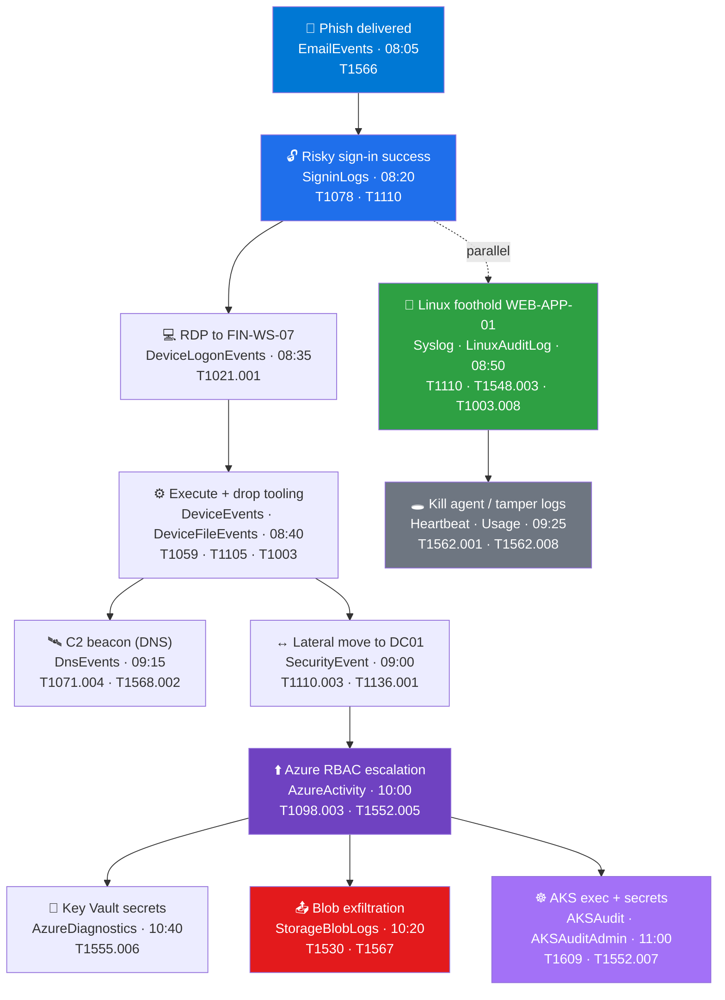

# 🎯 Operation Quiet Ledger — a correlated, multi-table intrusion

> A single intrusion on **2026-06-10**, captured across **18 of the library's tables**, so you can practise **cross-table correlation, incident triage, and analytic-rule testing** on data that actually joins up. Every query below runs against the per-table sample CSVs in [`sentinel/tables/`](../../README.md) once you've ingested them.

> [!NOTE]
> These are **hunting & teaching artifacts**, not finished detections. Thresholds are realistic starting points; the data deliberately mixes attacker activity with benign noise so an over-broad rule visibly over-fires.

---

## TL;DR

An emailed phish lands in the inboxes of `priya.menon` and `alexw`. `alexw` is compromised and driven from a Netherlands Tor IP (`185.220.101.2`) into a **risky-but-successful Entra sign-in**, then a **remote-interactive logon to `FIN-WS-07`**. From there: tooling is dropped and run, **C2 over DNS** begins, the actor **moves laterally to `DC01`**, then **pivots into Azure** — escalating RBAC, harvesting **Key Vault** secrets, **listing storage keys**, and **exfiltrating finance blobs** from `stcontosofin` — and finally into **AKS** (`aks-prod-01`) to read secrets and patch a cluster-role binding. A **parallel Linux foothold** on `WEB-APP-01` (SSH brute force → sudo → auditd tampering) **kills the agent**, which shows up as a **Heartbeat gap** and an **ingestion drop** in `Usage`.

## 🗺️ Attack flow



## 🎭 Cast & indicators of compromise

| Type | Value | Role in the story |
|---|---|---|
| User | `alexw@contoso.com` | Compromised finance analyst — the through-line |
| User | `priya.menon@contoso.com` | Also phished (delivery blast radius) |
| Service principal | `svc-backup@contoso.com` | Abused for Azure persistence/escalation |
| Benign | `meganb@`, `jamest@`, `dvora@`, `itadmin@` | Noise + legitimate admin remediation |
| Attacker IP | `185.220.101.2` (NL) | Primary — sign-in, RDP, Azure, exfil, AKS |
| Attacker IP | `91.219.236.18` | Secondary — phish sender, Linux C2 |
| Domain | `login-contoso-sso.com` | Credential-harvest phishing page |
| Domain | `badupdate-cdn.com` | Payload host + C2 |
| Host | `FIN-WS-07` | alexw's workstation (patient zero) |
| Host | `DC01` | Domain controller (lateral target) |
| Host | `WEB-APP-01` | Ubuntu server (parallel Linux foothold) |
| Cluster | `aks-prod-01` | AKS production cluster |
| Azure | `stcontosofin` · `kv-contoso-prod` · `rg-finance-prod` | Exfil target / secrets / resource group |

## ⏱️ Kill chain — timeline

| Time (UTC) | Tactic | Technique | Table(s) | What happened |
|---|---|---|---|---|
| 08:05 | Initial Access | [T1566](https://attack.mitre.org/techniques/T1566/) | `EmailEvents` | Lookalike-domain phish **Delivered** to priya.menon + alexw (ZAP missed it) |
| 08:20 | Valid Accounts / Brute Force | [T1078](https://attack.mitre.org/techniques/T1078/) · [T1110](https://attack.mitre.org/techniques/T1110/) | `SigninLogs` | Failures then a **high-risk success** from `185.220.101.2` (NL) |
| 08:35 | Lateral / Remote Services | [T1021.001](https://attack.mitre.org/techniques/T1021/001/) | `DeviceLogonEvents` | **RemoteInteractive** logon onto `FIN-WS-07` from the attacker IP |
| 08:40–09:30 | Execution / Ingress / Cred Access | [T1059](https://attack.mitre.org/techniques/T1059/) · [T1105](https://attack.mitre.org/techniques/T1105/) · [T1003](https://attack.mitre.org/techniques/T1003/) | `DeviceEvents` · `DeviceFileEvents` | LOLBins, AMSI catch; payload dropped from `badupdate-cdn.com`; cred-dumper renamed; finance docs zipped |
| 08:50–09:25 | (parallel) Linux foothold | [T1110](https://attack.mitre.org/techniques/T1110/) · [T1548.003](https://attack.mitre.org/techniques/T1548/003/) · [T1003.008](https://attack.mitre.org/techniques/T1003/008/) | `Syslog` · `LinuxAuditLog` | SSH brute force on `WEB-APP-01` → sudo → `/etc/shadow` read → auditd tamper |
| 09:00 | Lateral / Persistence | [T1110.003](https://attack.mitre.org/techniques/T1110/003/) · [T1136.001](https://attack.mitre.org/techniques/T1136/001/) | `SecurityEvent` | Spray→logon on `DC01`; 4672 special privileges; **4720 account created** |
| 09:15 | Command & Control | [T1071.004](https://attack.mitre.org/techniques/T1071/004/) · [T1568.002](https://attack.mitre.org/techniques/T1568/002/) | `DnsEvents` | Beaconing + **DGA subdomains** to `badupdate-cdn.com`, NXDOMAIN spikes |
| 09:25 | Defense Evasion | [T1562.001](https://attack.mitre.org/techniques/T1562/001/) · [T1562.008](https://attack.mitre.org/techniques/T1562/008/) | `Heartbeat` · `Usage` | `WEB-APP-01` agent **goes silent**; `Syslog` ingestion **drops to 0** |
| 09:30 | Persistence | [T1543.003](https://attack.mitre.org/techniques/T1543/003/) | `Event` | Malicious **7045 service install** on `DC01` |
| 10:00 | Privilege Escalation | [T1098.003](https://attack.mitre.org/techniques/T1098/003/) · [T1552.005](https://attack.mitre.org/techniques/T1552/005/) | `AzureActivity` | **roleAssignments/write** (Owner), **listKeys** on `stcontosofin`, NSG opened |
| 10:20 | Exfiltration | [T1530](https://attack.mitre.org/techniques/T1530/) · [T1567](https://attack.mitre.org/techniques/T1567/) | `StorageBlobLogs` | **AccountKey + Anonymous** GetBlob burst of finance blobs |
| 10:40 | Credential Access | [T1555.006](https://attack.mitre.org/techniques/T1555/006/) | `AzureDiagnostics` | **Key Vault** SecretGet/KeyGet on `kv-contoso-prod` after the role grant |
| 10:30–11:00 | Defense Evasion | [T1565](https://attack.mitre.org/techniques/T1565/) · [T1556](https://attack.mitre.org/techniques/T1556/) | `DnsAuditEvents` | Rogue DNS records + malicious forwarder planted on `DC01` |
| 11:00 | Container Exec / Cred Access | [T1609](https://attack.mitre.org/techniques/T1609/) · [T1552.007](https://attack.mitre.org/techniques/T1552/007/) · [T1098](https://attack.mitre.org/techniques/T1098/) | `AKSAudit` · `AKSAuditAdmin` | `pods/exec`, secret reads, **clusterrolebinding → cluster-admin**, logging deleted |

🔖 Load the full coverage map into [MITRE ATT&CK Navigator](https://mitre-attack.github.io/attack-navigator/): **[`mitre-navigator-layer.json`](mitre-navigator-layer.json)** (45 techniques).

---

## 🔗 Cross-table correlation — the queries that reconstruct the intrusion

These are the heart of the scenario: each joins ≥2 tables on the **shared cast/IOCs**. Run them after ingesting the sample CSVs.

### 1. Phish → compromised sign-in *(EmailEvents → SigninLogs, on recipient = UPN)*
Connect the delivered phish to the risky sign-in of a recipient — the "did the click work?" question.
```kusto
let phished =
    EmailEvents
    | where ThreatTypes has "Phish" and LatestDeliveryLocation == "Inbox"
    | distinct RecipientEmailAddress;
SigninLogs
| where ResultType == "0" and RiskLevelDuringSignIn in ("medium", "high")
| where UserPrincipalName in (phished)
| project TimeGenerated, UserPrincipalName, IPAddress, Location, RiskLevelDuringSignIn, AppDisplayName
| sort by TimeGenerated asc
```

### 2. Risky sign-in → endpoint logon *(SigninLogs → DeviceLogonEvents, on attacker IP)*
Tie the cloud identity event to the on-host RDP from the **same source IP**, within 30 minutes.
```kusto
SigninLogs
| where IPAddress == "185.220.101.2" and ResultType == "0"
| project SigninTime = TimeGenerated, UserPrincipalName, IPAddress
| join kind=inner (
    DeviceLogonEvents
    | where ActionType == "LogonSuccess" and LogonType == "RemoteInteractive"
    | project LogonTime = TimeGenerated, DeviceName, AccountName, RemoteIP
) on $left.IPAddress == $right.RemoteIP
| where LogonTime between (SigninTime .. SigninTime + 30m)
| project SigninTime, LogonTime, UserPrincipalName, DeviceName, AttackerIP = IPAddress
```

### 3. Storage exfil chained to the key theft *(AzureActivity → StorageBlobLogs, same account + IP)*
The `listKeys` call (control plane) immediately precedes the **AccountKey** blob reads (data plane) — classic key-theft-to-exfil.
```kusto
let keyTheft =
    AzureActivity
    | where OperationNameValue has "listKeys" and ActivityStatusValue == "Success"
    | where tostring(split(CallerIpAddress, ":")[0]) == "185.220.101.2"
    | distinct AccountName = Resource;
StorageBlobLogs
| where AuthenticationType in ("AccountKey", "Anonymous")
| where tostring(split(CallerIpAddress, ":")[0]) == "185.220.101.2"
| summarize Reads = count(), MB = round(sum(ResponseBodySize) / 1048576.0, 1),
            Ops = make_set(OperationName) by AccountName, CallerIp = CallerIpAddress
| sort by MB desc
```

### 4. Privilege grant → secret harvest *(AzureActivity → AzureDiagnostics, on caller IP + time)*
A role is granted, then **Key Vault** access flips from Forbidden to Success from the same IP.
```kusto
AzureActivity
| where OperationNameValue has "roleAssignments/write" and ActivityStatusValue == "Success"
| where tostring(split(CallerIpAddress, ":")[0]) == "185.220.101.2"
| project RoleGrantTime = TimeGenerated, Caller, GrantIp = tostring(split(CallerIpAddress, ":")[0])
| join kind=inner (
    AzureDiagnostics
    | where ResourceProvider == "MICROSOFT.KEYVAULT" and OperationName in ("SecretGet", "KeyGet")
    | where ResultType == "Success"
    | project KvTime = TimeGenerated, OperationName, requestUri_s, KvIp = identity_claim_ipaddr_s
) on $left.GrantIp == $right.KvIp
| where KvTime > RoleGrantTime
| project RoleGrantTime, KvTime, Caller, OperationName, requestUri_s
```

### 5. Unified actor timeline *(union of 4 tables for one identity)*
"Show me everything `alexw` touched, everywhere" — the single most useful triage query. Note each table stores the identity in a **different column** (the whole point of the schema docs).
```kusto
let actor = "alexw@contoso.com";
union
  (SigninLogs      | where UserPrincipalName == actor
     | project TimeGenerated, Source = "SigninLogs",     Action = strcat("Sign-in ", ResultType), Where = IPAddress),
  (OfficeActivity  | where UserId == actor
     | project TimeGenerated, Source = "OfficeActivity", Action = Operation, Where = ClientIP),
  (AzureActivity   | where Caller == actor
     | project TimeGenerated, Source = "AzureActivity",  Action = OperationNameValue, Where = CallerIpAddress),
  (StorageBlobLogs | where RequesterUpn == actor
     | project TimeGenerated, Source = "StorageBlobLogs",Action = OperationName, Where = CallerIpAddress)
| sort by TimeGenerated asc
```

### 6. Defense evasion triangulated *(Heartbeat gap + Usage drop)*
A host that **stops beaconing** while its **ingestion falls to zero** is a logging-tamper tell — two independent signals agreeing.
```kusto
// 6a — which agents went silent?
Heartbeat
| summarize LastSeen = max(TimeGenerated) by Computer
| extend SilentFor = now() - LastSeen
| where SilentFor > 30m
| project Computer, LastSeen, SilentFor
```
```kusto
// 6b — which data sources flatlined? (Syslog drops to 0 at 11:00)
Usage
| where DataType == "Syslog"
| summarize MB = sum(Quantity) by bin(TimeGenerated, 1h)
| render timechart
```

### 7. Lateral movement on the DC *(SecurityEvent, spray → success from the attacker IP)*
Single table, but the corroborating view of step 2 on the **domain controller**.
```kusto
SecurityEvent
| where Computer == "DC01" and IpAddress == "185.220.101.2"
| summarize Failed = countif(EventID == 4625), Success = countif(EventID == 4624),
            FirstSeen = min(TimeGenerated), LastSeen = max(TimeGenerated),
            Targets = make_set(TargetUserName, 20) by IpAddress
| where Failed >= 3 and Success >= 1
```

### 8. AI-agent abuse joined to the same session *(ASimAgentEventLogs → SigninLogs)*
The modern twist: the compromised identity drives an **AI agent** to call sensitive tools from the attacker IP.
```kusto
ASimAgentEventLogs
| where SrcIpAddr == "185.220.101.2" and isnotempty(ToolName)
| project TimeGenerated, ActorUsername, SrcAgentName, ToolName, ModelName
| join kind=leftouter (
    SigninLogs | where IPAddress == "185.220.101.2"
    | project ActorUsername = UserPrincipalName, SigninRisk = RiskLevelDuringSignIn
) on ActorUsername
| sort by TimeGenerated asc
```

---

## 🩺 Triage walkthrough — from one alert to full blast radius

A realistic SOC path. Start with the alert most environments would actually fire first and pivot outward:

1. **Alert fires:** "Storage egress spike on `stcontosofin`" (`Alert` table / a metric rule). Pivot to **query 3** → confirms `AccountKey` reads from `185.220.101.2`.
2. **Where did the key come from?** **Query 3's** `listKeys` → run **query 4** → the keys followed a **role grant**, and the same IP hit **Key Vault**. This is hands-on-keyboard, not a script.
3. **Who is the actor?** Run **query 5** (unified timeline) for the `Caller` → it's `alexw`, and the timeline shows Office + sign-in activity too.
4. **How did `alexw` get compromised?** Run **query 2** → RDP from the attacker IP → **query 1** → a **delivered phish**. Root cause found.
5. **Blast radius:** the phish (query 1) also hit `priya.menon`; the attacker IP also appears on `DC01` (query 7) and in **AKS** (query 8 / `AKSAuditAdmin`). 
6. **Are we still seeing them?** **Query 6** shows `WEB-APP-01` went dark — assume the Linux foothold is **un-logged** and isolate the host out-of-band.

## 🔬 Hunting hypotheses that span the library

- **Impossible chain:** any UPN with a high-risk `SigninLogs` success **and** an `AzureActivity` `roleAssignments/write` within 4h (identity → cloud priv-esc).
- **Key-to-blob:** any `listKeys` in `AzureActivity` followed by `AccountKey` `StorageBlobLogs` reads > 100 MB from the same IP within 1h.
- **Silent host during activity:** any `Computer` with `SecurityEvent`/`Syslog` activity that then disappears from `Heartbeat` for > 30m in the same window.
- **Phish-to-pivot:** any `EmailEvents` `Delivered` phish recipient who then appears as a `DeviceLogonEvents` `RemoteInteractive` account within 1h.

## 🧪 Using this to test analytic rules

This dataset is purpose-built to **validate a detection before you ship it**:

1. **Ingest** the relevant table samples (ADX free cluster or a Log Analytics `datatable()` function — see the [library README](../../README.md#-how-to-use-this-library)).
2. **Run your rule's KQL** over the sample. A correct rule returns the malicious rows (e.g. the `185.220.101.2` cluster) and **ignores the benign noise** every file includes.
3. **Tune on the false positives** the noise produces — `dvora`/`itadmin` legitimate admin actions, `meganb` clean sign-ins, benign `GetBlob` over OAuth — these are exactly what over-broad rules trip on.
4. **Check entity mapping:** confirm your rule extracts the account/IP/host from the *correct* column per table (the [schema docs](../../README.md) list them) so entities populate in the incident.

> Because the cast is shared, you can also test **multi-stage / fusion-style** logic: a rule that correlates `SigninLogs` + `AzureActivity` should light up on this data and stay quiet on a single-table benign workspace.

## 📚 References
- Per-table schemas & single-table hunts: [`sentinel/tables/`](../../README.md)
- [Hunt for threats with Microsoft Sentinel](https://learn.microsoft.com/en-us/azure/sentinel/hunting) · [Advanced hunting in Defender XDR](https://learn.microsoft.com/en-us/defender-xdr/advanced-hunting-overview)
- [MITRE ATT&CK](https://attack.mitre.org/) · [ATT&CK Navigator](https://mitre-attack.github.io/attack-navigator/)
- Companion language course: [KQL Mastery Path](../../../kql/README.md)
